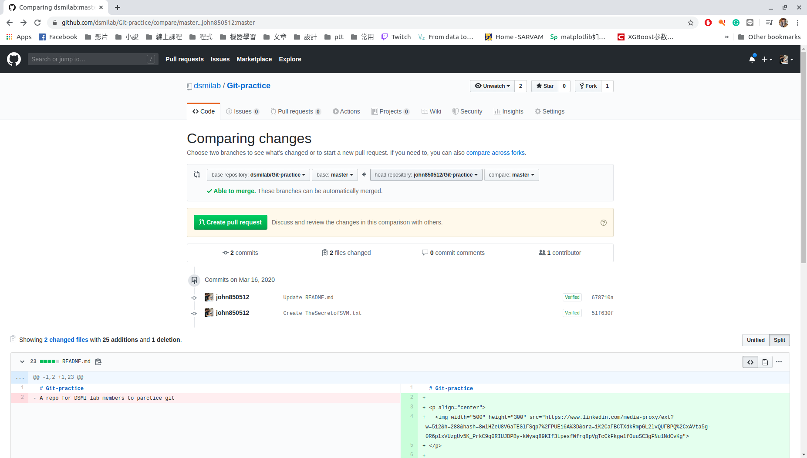
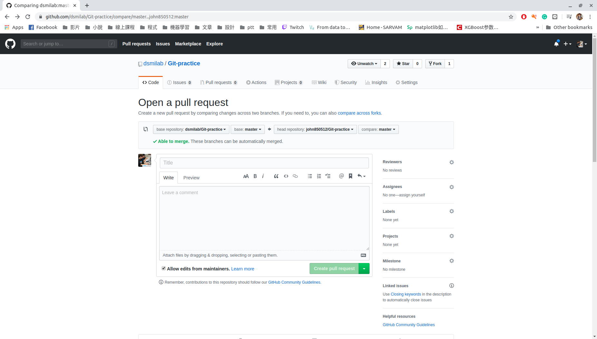
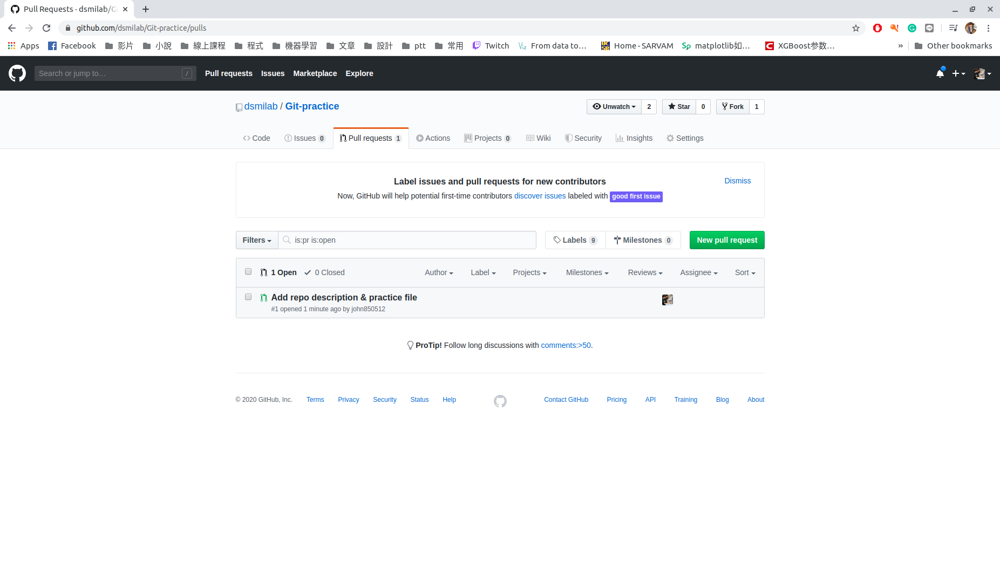
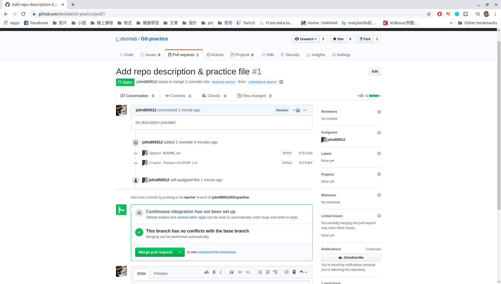

# Git-practice

  

A repo for DSMI lab members to practice git.

You are welcome to use this repo to practice your skill of git / Github

## Introduction
Below briefly describe the step of using git / Github, once you understand the logic, you can practice under the `/practice` folder.

### 1. fork the repo you need
This step need to finish under Github
### 2. Modify your repo
The operation you will need: `clone`, `push`, `commit`, `pull`
### 3. Pull Request your repo to the origin repo
Once you modify the repo under your GitHub, click `Pull requests` button and start your PR. 
The PR page will show the difference between your repo & origin repo, and then tell if you can send a PR.
- Note: if it tells you can nott send a PR, it means there exist the **conflict**. You need to re-send the PR after solve the conflict.

Click `Create pull request` to write the message of this PR. You need to describe title & comment.

For DSMI lab members, It is suggested to follow the rules below:
1. Capitalize the subject line
2. Use the imperative mood in the subject line
4. Limit the subject line to 50 characters
3. Wrap the body at 72 characters
5. (optional)Assign a assignees & multi-reviewer

After send a PR, you can see PR in the orign repo website!
- Note: In DSMI lab, only the admin have the permission to merge the PR

## Reference
You are welcome to share any reference :)
- [How to Write a Git Commit Message](https://chris.beams.io/posts/git-commit/)
